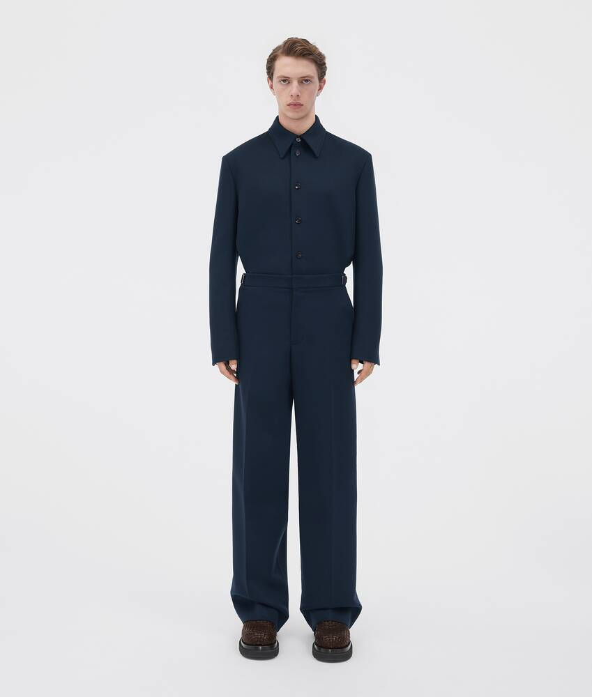
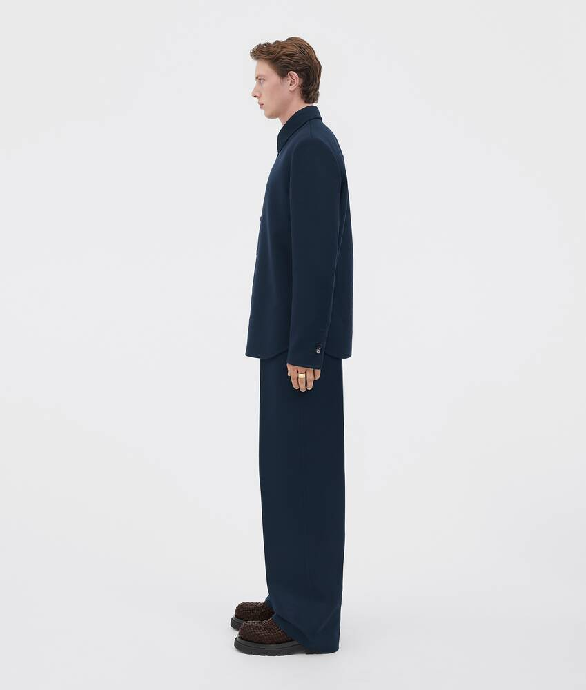

[](https://sjinwon.github.io/redesign-VOTTEGA-VENETA-responsiveweb/)

# Bottega Veneta Web Redesign

### 제작기간 : 5일

### 사용언어 : html css javasctript

<br>

## ✔ 디자인 컨셉
기존의 보테가 베네타 웹은 심플보다는 지루함에 가까웠던 것 같다. black & white로 잡지와같은 무드를 만들어 내고자 했다.

## ✔ fonts 
페이지에서 사용할 'Mosk-Light','Mosk-Bold','SUIT-Bold','SUIT-Medium','SUIT-Regular','Tahu_'폰트를 지정한다.


``` css
@font-face {/* title font */
  font-family: "Kano";
  src: url(../fonts/Kano.woff);
}
@font-face {
  font-family: "AppleSDGothicNeoM";
  src: url(../fonts/AppleSDGothicNeoM.woff);
}
@font-face {
  font-family: "AppleSDGothicNeoL";
  src: url(../fonts/AppleSDGothicNeoL.woff);
}
@font-face {
  font-family: "AppleSDGothicNeoB";
  src: url(../fonts/AppleSDGothicNeoB_1.woff);
}
@font-face {
  font-family: "AppleSDGothicNeoEB";
  src: url(../fonts/AppleSDGothicNeoEB_1.woff);
}
@font-face {
  font-family: "AppleSDGothicNeoH";
  src: url(../fonts/AppleSDGothicNeoH_1.woff);
}
```

<br>

## ✔ Slick Slide
다음 플러그인으로 slick slide를 사용했다.

``` html
  <link rel="stylesheet" href="./css/slick-theme.css">
  <link rel="stylesheet" href="./css/slick.css">

  <script defer src="./js/slick.js"></script>
```
### 사용법은 간단하다.

1. Slick 홈페이지의 오른쪽 상단에 get it now를 클릭 후 다운로드

    기본적으로 Slick Slider는 jQuery 기반으로 만들어진 라이브러리라 jQuery가 필요하다.

    slick-theme.css 의 기본 다음 및 이전 화살표 버튼은 횐색바탕에 투명색으로 설정이 되어 있어 배경화면이 흰색인 경우 잘 안 보이기에 상황에 맞게 수정이 필요하다.

``` html
  <link rel="stylesheet" type="text/css" href="/plugin/slick/slick.css"/>
  <link rel="stylesheet" type="text/css" href="/plugin/slick/slick-theme.css"/>

  <script type="text/javascript" src="/js/jquery.js"></script>
  <script type="text/javascript" src="/plugin/slick/slick.js"></script>
```

2. Slick Slider의 기본 HTML 구성은 아래의 코드처럼 div의 형태로 구성되어 있는 html 문서를 슬라이더 형태로 변경을 해준다.

    만약 div 형태가 아닌 다른 태그는 아래 써둔 slide 옵션을 조정하면 된다.

    더 자세한 옵션은 slick의 도큐먼트(https://github.com/kenwheeler/slick/)를 참고하자.

``` html
<!-- stlye 은 slick 영역 확인용 -->
	<div style="padding:300px 100px; background-color: skyblue;">
	  	<div id="slider-div"  >
		    <div>1</div>
		    <div>2</div>
		    <div>3</div>
		    <div>4</div>
		    <div>5</div>
		    <div>6</div>
	  	</div>
	</div>
```

3. Slide Option
``` html
<script>
  		$(function(){
			$('#slider-div').slick({
				slide: 'div',		//슬라이드 되어야 할 태그 ex) div, li 
				infinite : true, 	//무한 반복 옵션	 
				slidesToShow : 4,		// 한 화면에 보여질 컨텐츠 개수
				slidesToScroll : 1,		//스크롤 한번에 움직일 컨텐츠 개수
				speed : 100,	 // 다음 버튼 누르고 다음 화면 뜨는데까지 걸리는 시간(ms)
				arrows : true, 		// 옆으로 이동하는 화살표 표시 여부
				dots : true, 		// 스크롤바 아래 점으로 페이지네이션 여부
				autoplay : true,			// 자동 스크롤 사용 여부
				autoplaySpeed : 10000, 		// 자동 스크롤 시 다음으로 넘어가는데 걸리는 시간 (ms)
				pauseOnHover : true,		// 슬라이드 이동	시 마우스 호버하면 슬라이더 멈추게 설정
				vertical : false,		// 세로 방향 슬라이드 옵션
				prevArrow : "<button type='button' class='slick-prev'>Previous</button>",		// 이전 화살표 모양 설정
				nextArrow : "<button type='button' class='slick-next'>Next</button>",		// 다음 화살표 모양 설정
				dotsClass : "slick-dots", 	//아래 나오는 페이지네이션(점) css class 지정
				draggable : true, 	//드래그 가능 여부 
				
				responsive: [ // 반응형 웹 구현 옵션
					{  
						breakpoint: 960, //화면 사이즈 960px
						settings: {
							//위에 옵션이 디폴트 , 여기에 추가하면 그걸로 변경
							slidesToShow:3 
						} 
					},
					{ 
						breakpoint: 768, //화면 사이즈 768px
						settings: {	
							//위에 옵션이 디폴트 , 여기에 추가하면 그걸로 변경
							slidesToShow:2 
						} 
					}
				]

			});
  		})
  		
	</script>
```

<br>

### 사용 예

``` html
<div id="slider-div">
	<div class="slider__cont slider__cont1">
		<div class="img-box">
			
			
		</div>
		<p>드라이 스트레치 리브 디테일 코튼 탱크 탑</p>
		<span class="price">￦ 590,000</span>
		<p>사전주문</p> 
	</div>
	<div class="slider__cont slider__cont2">
		<div class="img-box">
			
			
		</div>
		<p>프린트 가죽 핀스트라이프 셔츠</p>
		<span class="price">￦ 6,990,000</span>
		<p>사전주문</p> 
	</div>
	<div class="slider__cont slider__cont3">
		<div class="img-box">
			
			
		</div>
		<p>울 플란넬 와이드 트라우저</p>
		<span class="price">￦ 2,745,000</span>
		<p>Runway</p> 
	</div>
<div>
```